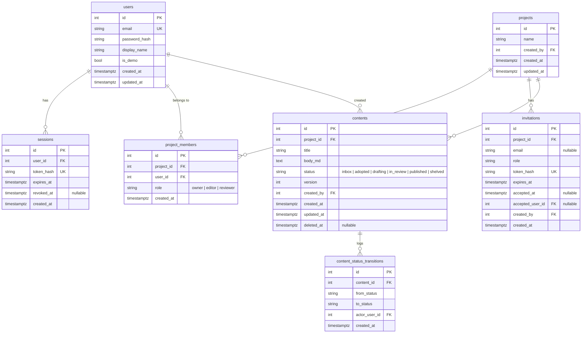
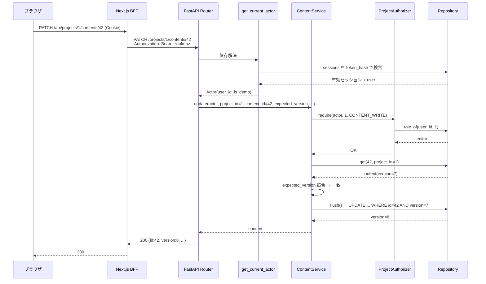
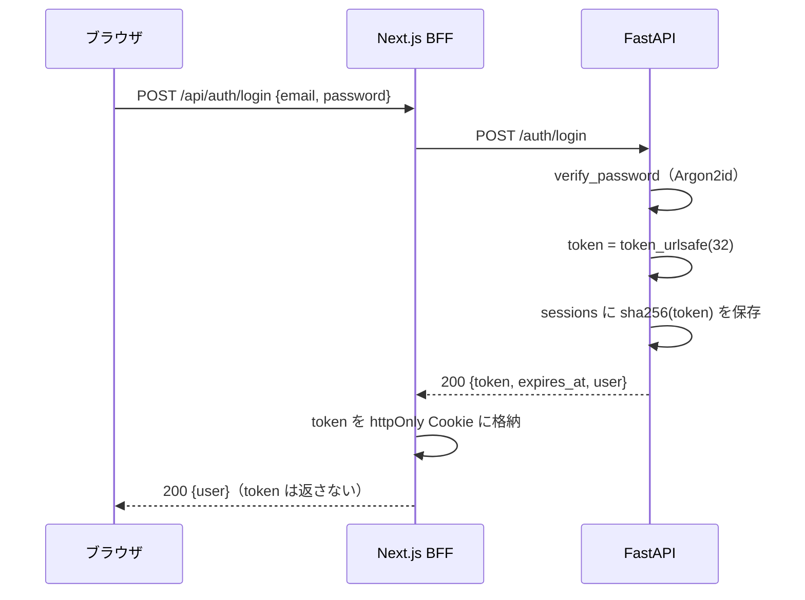

# design.md — foundation（認証・認可・コンテンツ土台）

> **前提**：`requirements.md`（承認済み）、ADR-0002（SQLAlchemy 2.0）、ADR-0009（レイヤー構成）、ADR-0012（FastAPI）、ADR-0014（認証トークンと BFF）。
> **このドキュメントの範囲**：M0 の実装に入る前の設計。`requirements.md` §8 の未決事項をここで解消する。

---

## 1. 設計の狙い

1. **入口が3つ（ブラウザ / MCP / ジョブ）でも認可を1回しか実装しない** — 認可判定を Service 層に置き、HTTP に依存させない
2. **層の分離を CI で強制する** — `.importlinter` の契約を最初のモジュールと同時に入れる
3. **後続スペックが乗る骨格を最小で用意する** — テーブル・例外体系・セッション配線・テスト基盤。機能は足さない

---

## 2. アーキテクチャ全体

### 2-1. バックエンドのモジュール構成

```
backend/app/
├── main.py                  アプリ生成・ルーター登録・例外ハンドラ登録
├── cli.py                   初期データ投入（§9-0）。HTTP を経由しない管理操作
├── core/
│   ├── config.py            設定（Pydantic Settings）
│   ├── db.py                async engine / async_sessionmaker
│   ├── security.py          パスワードハッシュ・トークン生成/照合
│   ├── authorization.py     Actor / Permission / Role・ProjectAuthorizer
│   ├── exceptions.py        アプリ例外の基底と種類
│   └── exception_handlers.py 例外 → HTTP ステータスの対応
├── modules/
│   ├── auth/                ログイン・ログアウト・現在のユーザー解決
│   │   ├── router.py  service.py  repository.py  models.py  schemas.py  deps.py
│   │   └── ※ repository.py に UserRepository / SessionRepository、models.py に users / sessions
│   ├── projects/            企画・メンバー・招待（projects / project_members / invitations）
│   └── contents/            コンテンツ CRUD・状態遷移（contents / content_status_transitions）
└── migrations/              Alembic
```

### 2-2. 依存方向（ADR-0009）

```
router.py  ──→  service.py  ──→  repository.py  ──→  DB
（HTTP のみ）    （業務ルール・認可）   （SQLAlchemy）
```

- **`sqlalchemy` を import してよいのは `repository.py` / `models.py` / `deps.py` / `core/db.py` / `cli.py` / `migrations/` のみ**
  （`deps.py` は DI の組み立て役なので `AsyncSession` に触れる。§2-3）
- `service.py` は `AsyncSession` を受け取らない。Repository を注入される
- `service.py` に FastAPI（`Request` / `Response` / `Depends`）を import しない
- 認可は `service.py` の中で `ProjectAuthorizer` を呼ぶ。`router.py` では認可しない
- **`core/` は `modules/` を import しない。** 逆流すると `modules.projects.service → core.authorization → modules.projects.repository`
  の循環一歩手前になる（ADR-0009 §理由4 が「設計が壊れているサイン」と名指しした形）。
  `core` が Repository を必要とする場合は `Protocol` で受ける（§5-2）

### 2-3. DI の組み立て（`deps.py`）

```python
# modules/contents/deps.py
async def get_content_service(
    session: AsyncSession = Depends(get_session),
) -> ContentService:
    return ContentService(
        contents=ContentRepository(session),
        authz=ProjectAuthorizer(ProjectMemberRepository(session)),
        transitions=ContentTransitionRepository(session),
    )
```

Router は `ContentService` だけを `Depends` で受け取り、組み立てを知らない。

---

## 3. データモデル

### 3-1. ER 図（このスペックの範囲）



### 3-2. 補足

| 項目 | 決定 | 理由 |
|---|---|---|
| status の値 | コード上は英語（`inbox` / `adopted` / `drafting` / `in_review` / `published` / `shelved`）。UI 表示の日本語ラベルはフロント側で対応づけ | CLAUDE.md「識別子は英語」 |
| `contents` の削除 | **論理削除**（`deleted_at`）。Repository は既定で `deleted_at IS NULL` で絞る | 後続スペックでリビジョン・公開物が参照する。監査を残す |
| `role` の表現 | 文字列カラム ＋ アプリ側 `Role` StrEnum。DB の ENUM 型は使わない | 値の増減で migration を打たずに済む。CHECK 制約で担保 |
| `project_members` | `UNIQUE (project_id, user_id)` | F2「重複メンバーシップは作られない」 |
| `content_status_transitions` | 遷移専用の追記ログ。`content_revisions` には相乗りしない | 本文の履歴（`content-pipeline`）と状態遷移は変更理由が別。テーブルを分ける |
| インデックス | `contents (project_id, status)`、`sessions (token_hash)`、`project_members (user_id)`、`invitations (token_hash)` | 一覧・認証・メンバー解決の主経路 |

### 3-3. 楽観ロック（ADR-0002 §理由5）

`contents` に `__mapper_args__ = {"version_id_col": version}` を設定する。

- 通常の更新：Service は `expected_version` を受け取り、読み込んだ `content.version` と比較。不一致なら `VersionConflictError`（→ 409）
- flush 時：SQLAlchemy が `UPDATE ... WHERE id=? AND version=?` を発行し `version` を +1。競合で 0 行なら `StaleDataError` を捕捉して同じく 409
- **二段構え**にする理由：明示チェックは「送信前に既に古い」を早期に・分かりやすいエラーで返すため。flush 側のチェックは「読み込み〜flush の間に他トランザクションが更新した」競合を取りこぼさないため

**`version` が増えない場合がある。** `version_id_col` はオブジェクトが dirty のときだけ increment する。
同じ `title` / `body_md` を送った更新では UPDATE 自体が発行されず `version` は据え置きになる。
F6「更新のたびに増加する」はこの挙動を許容する（**値が変わっていない ＝ 他クライアントのキャッシュを無効化する必要がない**ため、
競合検出の正しさは損なわれない）。「PATCH を叩いた回数」を数えたくなったらそれは別の要件として起こす。

---

## 4. 認証設計

### 4-1. トークン方式（`requirements.md` §8）

**不透明トークン ＋ サーバー側 `sessions` テーブル**を採用する。JWT は採らない。

| 観点 | 判断 |
|---|---|
| F1「ログアウトすると以後 401」 | DB のレコードに `revoked_at` を打てば即失効。JWT だと失効リストが別途必要 |
| ストア | **PostgreSQL**。M0 時点で Redis は無い（ADR-0013 のジョブ基盤で初めて入る） |
| トークン生成 | `secrets.token_urlsafe(32)`。クライアントには生の文字列を返す |
| DB 保存 | `sha256(token)` のみ保存。DB が漏れてもトークンを復元できない |
| 有効期限 | 発行から 14 日（`expires_at`）。スライド更新は M0 ではやらない |
| 照合 | リクエストの Bearer トークンを sha256 して `sessions.token_hash` を引き、`revoked_at IS NULL AND expires_at > now()` を確認 |

### 4-2. パスワード

`core/security.py` に **Argon2id**（`argon2-cffi`）で `hash_password` / `verify_password` を実装する。bcrypt でも要件は満たすが、新規プロジェクトのため現行の推奨に合わせる。

**存在しない email でも必ずハッシュ検証を1回走らせる。** Argon2 は意図的に遅いため、
「ユーザーが見つからないので即 401」にすると応答時間が明確に短くなり、**登録済みメールアドレスを列挙できてしまう**。
`AuthService.login` は user が `None` のときダミーハッシュに対して `verify_password` を呼んでから 401 を返す。

### 4-3. 現在のユーザー解決（`modules/auth/deps.py`）

```python
async def get_current_actor(
    authorization: str | None = Header(default=None),
    session: AsyncSession = Depends(get_session),
) -> Actor:
    if authorization is None:
        raise AuthenticationError()                       # → 401
    token = _parse_bearer(authorization)                  # 形式不正 → AuthenticationError（401）
    row = await SessionRepository(session).find_valid_with_user(sha256(token))
    if row is None:
        raise AuthenticationError()                       # → 401
    return Actor(user_id=row.user.id, is_demo=row.user.is_demo)
```

**`Header(...)`（必須）にしない。** 必須にするとヘッダ欠落時に FastAPI が `RequestValidationError` を投げ、
**401 ではなく 422 が返る**。F1「トークンが無い／不正／期限切れのリクエストは 401 で拒否される」を満たすため、
既定値 `None` で受けて自分で `AuthenticationError` を投げる。

`find_valid_with_user` は `sessions` に `users` を join（`selectinload`）して1クエリで引く。
`is_demo` は**全リクエストで必要**なので、セッションとユーザーを2回に分けて引かない。

`Actor` は `{ user_id: int, is_demo: bool }` の値オブジェクト。**Service にはこの `Actor` だけを渡す**（`Request` も ORM の `User` も渡さない）。
`Actor` は `core/authorization.py` に置く（`modules` に依存させないため。§2-2）。

### 4-4. セッション（Unit of Work）のライフサイクルと commit 境界（`requirements.md` §8）

```python
# core/db.py
engine = create_async_engine(settings.database_url)        # postgresql+asyncpg://
async_session = async_sessionmaker(engine, expire_on_commit=False)

# 共通 dependency
async def get_session() -> AsyncIterator[AsyncSession]:
    async with async_session() as session:
        try:
            yield session
            await session.commit()      # ハンドラが正常終了したらコミット
        except Exception:
            await session.rollback()
            raise
```

- **1 HTTP リクエスト ＝ 1 セッション ＝ 1 トランザクション**。Service / Repository は `flush()` までしか呼ばない。`commit()` はこの dependency だけ
- ジョブ・MCP（後続スペック）は `async with async_session() as s:` を自前で開く。この dependency は使わない
- ADR-0002 §影響のとおり、詰め替え方針は §7 で定める

#### 【重要】commit 時の例外は HTTP レスポンスに変換できない

**FastAPI の dependency-with-yield は、`yield` より後のコードを「レスポンス送信後」に実行する**（FastAPI 0.106 以降）。
つまり上記の `session.commit()` で例外が出ても、**クライアントには既に 200 が返っている**。
`StaleDataError`（§3-3）や `UNIQUE (project_id, user_id)` 違反（§9-2）がここで初めて出ると、409 に変換されずに握り潰される。

そこで**制約として次を課す**（作法ではなく、正しさの要件として扱う）。

> **書き込みを伴う Service メソッドは、戻る前に必ず `flush()` する。**

flush を明示すればすべての制約違反・楽観ロック競合は**ハンドラ実行中に**発生し、`exception_handlers` が
正しいステータスに変換できる。dependency 側の `commit()` は「flush 済みの内容を確定するだけ」に痩せる。

- 検証：`INSERT` / `UPDATE` / `DELETE` を伴う Service メソッドのテストで、Service 単体（commit 前）に例外が出ることを確認する（§13）
- それでも commit が失敗した場合は 500 になる。**握り潰さずログに残す**（`exception_handlers` の最後の砦）
- 代替案として「カスタム `APIRoute` でハンドラ実行 → commit → レスポンス生成を1箇所に寄せる」があるが、
  M0 では上記の制約で足りるため採らない。**flush 忘れが実際に事故になったら再検討する**

---

## 5. 認可設計

### 5-1. Permission と Role（`core/authorization.py`）

```python
class Permission(StrEnum):
    PROJECT_VIEW            = "project:view"
    PROJECT_MANAGE_MEMBERS  = "project:manage_members"
    CONTENT_VIEW           = "content:view"
    CONTENT_WRITE          = "content:write"       # 作成・更新・削除
    CONTENT_TRANSITION     = "content:transition"  # 状態遷移

ROLE_PERMISSIONS: dict[Role, frozenset[Permission]] = {
    Role.OWNER:    frozenset(Permission),                               # 全部
    Role.EDITOR:   frozenset({PROJECT_VIEW, CONTENT_VIEW, CONTENT_WRITE, CONTENT_TRANSITION}),
    Role.REVIEWER: frozenset({PROJECT_VIEW, CONTENT_VIEW}),
}
VIEW_ONLY = frozenset({Permission.PROJECT_VIEW, Permission.CONTENT_VIEW})
```

`requirements.md` §4 の権限マトリクスと一致する。レビューコメント（`collaboration`）・公開（`publishing`）の Permission は各スペックで足す。

### 5-2. ProjectAuthorizer

```python
class MemberRoleReader(Protocol):
    """core は modules を知らない（§2-2）。Repository は構造的部分型で受ける。"""
    async def role_of(self, user_id: int, project_id: int) -> Role | None: ...


class ProjectAuthorizer:
    def __init__(self, members: MemberRoleReader):
        self._members = members

    async def require(self, actor: Actor, project_id: int, perm: Permission) -> Role:
        role = await self._members.role_of(actor.user_id, project_id)
        if role is None:
            raise NotFoundError("project")          # 非メンバーには存在を隠す（404）
        allowed = ROLE_PERMISSIONS[role]
        if actor.is_demo:
            allowed = allowed & VIEW_ONLY           # demo は role に関わらず閲覧のみ
        if perm not in allowed:
            raise ForbiddenError(perm)              # → 403
        return role
```

**`ProjectMemberRepository` は `MemberRoleReader` を継承しない。** `role_of` のシグネチャが一致していれば
mypy が構造的部分型として通す。これで `core/authorization.py` から `modules/` への import が消え、
§2-2 の「core は modules を知らない」が成立する（契約は §11 で CI 検証）。

| 判断 | 内容 |
|---|---|
| 非メンバーへの応答 | **404**（`NotFoundError`）。「その企画があるか」自体を隠す。F4 の「403 または存在を隠す 404」を 404 側で確定 |
| demo の扱い | `is_demo` なら許可集合を `VIEW_ONLY` と積集合。F3「ロールに関わらず 403」を満たす |
| 認可の位置 | **Service のメソッド冒頭で `await self._authz.require(...)` を明示的に呼ぶ**（`Depends` のガードにしない）。F5「HTTP 以外から呼んでも同一ロジック」を満たすため（`requirements.md` §8 を明示チェック側で確定） |
| 横断アクセス防止 | Repository の取得系は常に `project_id` を引数に取り `WHERE project_id = ?` を付ける。`content_id` だけで引ける経路を作らない（F5） |

### 5-3. 企画に紐づかない操作の認可（demo ガード）

**`ProjectAuthorizer.require` は `project_id` を前提とするため、企画がまだ存在しない操作を通らない。**
該当するのは次の2つで、どちらも `requirements.md` §4 のマトリクスで **demo = ×**。

| 操作 | 判定 |
|---|---|
| `POST /projects`（企画作成） | 認証済みなら誰でも。ただし **demo は不可** |
| `POST /invitations/{token}/accept`（招待受諾） | トークンが認可の代わり。ただし **demo は参加させない** |

`core/authorization.py` に企画非依存のガードを置き、各 Service の冒頭で呼ぶ。

```python
def require_not_demo(actor: Actor) -> None:
    if actor.is_demo:
        raise ForbiddenError("demo account is read-only")   # → 403
```

F3「デモアカウントによる作成・更新・削除・状態遷移・招待の API 呼び出しは、**ロールに関わらず** 403」は、
企画配下の操作を §5-2 の `VIEW_ONLY` 積集合が、企画に紐づかない操作をこのガードが受け持つ。**この2つで漏れなく覆う。**

### 5-4. Service での使い方（例）

```python
class ContentService:
    async def update(self, actor: Actor, project_id: int, content_id: int,
                     expected_version: int, *, title: str, body_md: str) -> Content:
        await self._authz.require(actor, project_id, Permission.CONTENT_WRITE)
        content = await self._contents.get(content_id, project_id)   # project スコープ
        if content is None:
            raise NotFoundError("content")
        if content.version != expected_version:
            raise VersionConflictError()
        content.title, content.body_md = title, body_md
        await self._contents.flush()
        return content
```

---

## 6. API 設計

### 6-1. エンドポイント一覧

| メソッド | パス | 認証 | 権限 | 説明 |
|---|---|---|---|---|
| POST | `/auth/login` | 不要 | — | email + password → トークン |
| POST | `/auth/logout` | 要 | — | 現在のトークンを失効 |
| GET  | `/auth/me` | 要 | — | 現在のユーザー情報 |
| POST | `/invitations/{token}/accept` | 不要※ | **demo は 403**（§5-3） | 招待受諾（未登録ならパスワード設定） |
| GET  | `/projects` | 要 | 自分がメンバーの企画のみ | 企画一覧（自分の role 付き） |
| POST | `/projects` | 要 | 認証済みなら誰でも（作成者が owner）。**demo は 403**（§5-3） | 企画作成 |
| GET  | `/projects/{id}` | 要 | PROJECT_VIEW | 企画詳細 |
| POST | `/projects/{id}/invitations` | 要 | PROJECT_MANAGE_MEMBERS | 招待発行（リンク） |
| GET  | `/projects/{id}/members` | 要 | PROJECT_VIEW | メンバー一覧 |
| PATCH | `/projects/{id}/members/{user_id}` | 要 | PROJECT_MANAGE_MEMBERS | ロール変更 |
| DELETE | `/projects/{id}/members/{user_id}` | 要 | PROJECT_MANAGE_MEMBERS | 除名 |
| GET  | `/projects/{id}/contents` | 要 | CONTENT_VIEW | コンテンツ一覧（`status` の単一値絞り込みのみ） |
| POST | `/projects/{id}/contents` | 要 | CONTENT_WRITE | 作成（初期 status = `inbox`） |
| GET  | `/projects/{id}/contents/{cid}` | 要 | CONTENT_VIEW | 詳細 |
| PATCH | `/projects/{id}/contents/{cid}` | 要 | CONTENT_WRITE | title / body_md 更新（`expected_version` 必須） |
| DELETE | `/projects/{id}/contents/{cid}` | 要 | CONTENT_WRITE | 論理削除 |
| POST | `/projects/{id}/contents/{cid}/transition` | 要 | CONTENT_TRANSITION | 状態遷移（`to` と `expected_version`） |

※ 招待受諾は未ログインでも叩けるが、トークン（URL の `{token}`）自体が認可の代わり。ログイン済みで叩いた場合は §5-3 の demo ガードが効く。

- **自己登録エンドポイントは存在しない**（F2）。ユーザーが増える経路は「招待受諾」と「§9-0 の CLI」だけ
- パスの `project_id` を常に明示し、リソースは必ず企画の下にぶら下げる（横断アクセス防止・F5）
- `GET /projects/{id}/contents` の `status` 絞り込みは、`requirements.md` §2-2 が `content-pipeline` へ送った
  「タグ・状態・キーワードでの絞り込み」の**一部を前倒ししている**。`WHERE project_id = ? AND status = ?` の1行で、
  §12-2 の最小画面（status 別リスト表示）に必要なため。**タグ・キーワード・複合条件は前倒ししない**

### 6-2. リクエスト / レスポンス例

```
POST /auth/login
  req:  { "email": "...", "password": "..." }
  res:  { "token": "<opaque>", "expires_at": "2026-09-13T...Z",
          "user": { "id": 1, "display_name": "...", "is_demo": false } }

POST /projects/1/contents/42/transition
  req:  { "to": "in_review", "expected_version": 7 }
  res:  { "id": 42, "status": "in_review", "version": 8 }
```

### 6-3. エラー体系（`core/exceptions.py` → `exception_handlers.py`）

| 例外クラス | HTTP | 使う場面 |
|---|---|---|
| `AuthenticationError` | 401 | トークンが無い / 不正 / 期限切れ / 失効、ログイン失敗 |
| `ForbiddenError` | 403 | 認証は通ったが権限が無い（demo の書き込み含む） |
| `NotFoundError` | 404 | リソース無し、非メンバーからの企画アクセス、**無効・期限切れ・受諾済みの招待トークン** |
| `VersionConflictError` | 409 | `expected_version` 不一致、`StaleDataError` |
| `InvalidStateTransitionError` | 422 | 定義されていない状態遷移 |
| Pydantic の `RequestValidationError` | 422 | 入力形式エラー（FastAPI 標準） |

- すべて `{ "error": { "code": "...", "message": "..." } }` の形に整形して返す。
  **`RequestValidationError` にも独自ハンドラを登録する**（FastAPI 既定の形式のままだと封筒が2種類になる）
- `InvalidStateTransitionError` と入力形式エラーはどちらも 422 になるため、
  クライアントは `error.code`（`invalid_state_transition` / `validation_error`）で区別する
- **招待の失敗は 410 を使わず 404 に寄せる。** 「そのトークンが存在したことがあるか」を漏らさないため、
  無効・期限切れ・受諾済みを区別せず同じ応答にする（§9-1）

---

## 7. Repository の返し方（ADR-0002 §影響の宿題）

**M0 の範囲では ORM モデルインスタンスをそのまま Service まで返す。** ただし次の制約を守る。

- Service は ORM モデルの**属性の読み書きだけ**を行い、`session` / クエリ発行系のメソッド（`.awaitable_attrs` での遅延ロード等）には触れない
- Router に返す直前に、Service または Router で Pydantic の**レスポンススキーマ（`schemas.py`）に詰め替える**。ORM モデルを JSON 化して外に出さない
- 遅延ロードによる N+1 を避けるため、一覧系 Repository は必要な関連を `selectinload` で明示的に取る

> dataclass への完全な詰め替え（Repository の戻り値をドメイン型にする）は、関連が増える `content-pipeline` 以降で費用対効果を再評価する。M0 でここに時間をかけない（Completion over Perfection）。

---

## 8. コンテンツの状態遷移

### 8-1. 遷移表（確定 — `requirements.md` F7 の草案を確定）

| from＼to | inbox | adopted | drafting | in_review | published | shelved |
|---|:---:|:---:|:---:|:---:|:---:|:---:|
| **inbox** | — | ○ | × | × | × | ○ |
| **adopted** | ○ | — | ○ | × | × | ○ |
| **drafting** | × | ○ | — | ○ | × | ○ |
| **in_review** | × | × | ○ | — | ×※ | ○ |
| **published** | × | × | × | × | — | × |
| **shelved** | ○ | × | × | × | × | — |

※ `in_review → published` は `publishing` スペックで解禁する（公開処理と一体で行うため、`transition` API 単体では許可しない）。`published` を from に持つ遷移（公開取消）も同スペック。

### 8-2. 実装方式

```python
ALLOWED: dict[Status, frozenset[Status]] = {
    Status.INBOX:     frozenset({Status.ADOPTED, Status.SHELVED}),
    Status.ADOPTED:   frozenset({Status.INBOX, Status.DRAFTING, Status.SHELVED}),
    Status.DRAFTING:  frozenset({Status.ADOPTED, Status.IN_REVIEW, Status.SHELVED}),
    Status.IN_REVIEW: frozenset({Status.DRAFTING, Status.SHELVED}),
    Status.PUBLISHED: frozenset(),
    Status.SHELVED:   frozenset({Status.INBOX}),
}
```

- 遷移表はモジュール内の定数。`in_review → published` は `publishing` が `ALLOWED[IN_REVIEW]` に追加する（テーブルを書き換えず集合に足す設計）
- `ContentService.transition(actor, project_id, content_id, to, expected_version)`：
  1. `authz.require(CONTENT_TRANSITION)`
  2. `content` 取得（無ければ 404）
  3. `expected_version` 照合（不一致 409）
  4. `to not in ALLOWED[content.status]` → `InvalidStateTransitionError`（422）
  5. `content.status = to`、`flush()`（`version` が +1）
  6. `content_status_transitions` に1行追記（`from` / `to` / `actor_user_id`）
- 手順3と5の楽観ロックで、同時に走った二重遷移の一方が 409 で弾かれる（F7「不正な状態にならない」）

---

## 9. ユーザーが増える経路

### 9-0. 最初のユーザーと デモアカウント（bootstrap）

**招待フローだけでは誰もログインできない。** 自己登録 API が無く（F2）、招待を発行できるのは企画の owner で、
企画を作れるのは認証済みユーザー。**循環していて入口が無い。** M0 の判定「ログインして、企画を作り…」に到達できない。

そこで **HTTP を経由しない管理コマンド `app/cli.py` を1本置く。**

```bash
docker compose exec backend python -m app.cli create-user \
    --email owner@example.com --display-name まんどぅ
docker compose exec backend python -m app.cli create-user \
    --email demo@example.com --display-name デモ --demo
```

| 項目 | 決定 |
|---|---|
| 置き場所 | `app/cli.py`。`async with async_session()` を自前で開く（§4-4 の dependency は使わない） |
| 実装 | **`AuthService` / `UserRepository` を呼ぶ。** SQL を直書きしない（パスワードハッシュ化を二重実装しないため） |
| パスワード | 引数で渡さず、対話入力するか自動生成して標準出力に1回だけ出す（シェル履歴に残さない） |
| デモアカウント | `--demo` で `is_demo=True`。企画への参加は、owner が発行した招待リンクを **CLI から受諾させる**（`accept-invitation`）か、`add-member` で直接付与する |
| 位置づけ | **運用の入口であって API ではない。** ここに機能を足さない。増やしたくなったら招待フロー側で解決する |

Alembic のデータマイグレーションにしない理由：**環境ごとに違う値（メールアドレス・パスワード）をマイグレーション履歴に残したくない**ため。

### 9-1. 招待フロー（`requirements.md` §8）

**M0 はリンク方式のみ。** メール送信基盤は持たない（`email` カラムは任意入力として記録するに留める）。

1. owner が `POST /projects/{id}/invitations`（`role`、任意で `email`）→ サーバーが `token = token_urlsafe(32)` を生成、`sha256` を `invitations` に保存、**受諾 URL（`/invite/{token}`）をレスポンスで返す**。owner がそれを本人に手渡す
2. 受諾者が受諾 URL を開く → フロントが `POST /invitations/{token}/accept` を呼ぶ
   - 未ログイン かつ 未登録：リクエストに `display_name` / `password` を含めさせ、`users` を作成
   - 既ログイン：その `Actor` を使う（**demo なら 403**・§5-3）
3. サーバー：`token_hash` で招待を引き、`accepted_at IS NULL AND expires_at > now()` を確認（満たさなければ **404**・§6-3）
   → `project_members` に追加 → `invitations.accepted_at` / `accepted_user_id` を更新
4. `expires_at` は発行から 7 日

### 9-2. 既にメンバーだった場合（F2「重複メンバーシップを作らない」）

**既存のロールを上書きしない。何もせず成功として扱い、`invitations` は受諾済みにする。**

上書き（upsert）にすると、**招待リンクが降格の抜け道になる。**

> owner が1人しかいない企画で、その owner が `reviewer` 招待リンクを踏む
> → upsert で owner が reviewer に降格 → **企画から owner が消える**

`PATCH` / `DELETE` の「最後の owner を守る」ガードは招待受諾の経路には掛からないため、
**上書きを許す限りこの穴は塞げない。** ロール変更は `PATCH /projects/{id}/members/{user_id}`（owner のみ）に一本化する。

- 実装は `INSERT ... ON CONFLICT (project_id, user_id) DO NOTHING`
- レスポンスは 200 で、現在のロール（＝既存のもの）を返す。招待のロールと違い得ることを明示する

### 9-3. 最後の owner を守る（F2）

`PATCH`（降格）・`DELETE`（除名）の Service で、対象が対象企画の owner かつ他に owner が居ない場合 `ForbiddenError`。

- 判定と更新の間に他トランザクションが owner を減らす競合を避けるため、**`project_members` の owner 行を
  `SELECT ... FOR UPDATE` で押さえてから数える**（企画あたり数行なので費用は無視できる）
- §9-2 により、招待受諾からこのガードを迂回する経路は存在しない

---

## 10. シーケンス

### 10-1. 認証付きリクエスト ＋ 認可



### 10-2. ログイン



---

## 11. レイヤー依存の強制（`.importlinter`）

`backend/.importlinter` に以下の契約を置き、CI（`lint-imports`）で検証する。

```ini
[importlinter]
root_package = app

[importlinter:contract:layers]
name = Controller -> Service -> Repository の一方向
type = layers
containers =
    app.modules.auth
    app.modules.projects
    app.modules.contents
layers =
    router
    service
    repository

[importlinter:contract:service-no-sqlalchemy]
name = Service は sqlalchemy を直接 import しない
type = forbidden
source_modules =
    app.modules.auth.service
    app.modules.projects.service
    app.modules.contents.service
forbidden_modules =
    sqlalchemy
    app.core.db
allow_indirect_imports = True

[importlinter:contract:service-no-fastapi]
name = Service は FastAPI を知らない
type = forbidden
source_modules =
    app.modules.auth.service
    app.modules.projects.service
    app.modules.contents.service
forbidden_modules =
    fastapi
    starlette

[importlinter:contract:core-independence]
name = core は modules を知らない
type = forbidden
source_modules =
    app.core
forbidden_modules =
    app.modules
```

### 書き方の注意（ここを外すと契約が動かない・意図せず落ちる）

| 項目 | 内容 |
|---|---|
| `containers` と `layers` の関係 | **`layers` は `containers` からの相対名**。`containers = app` のまま `layers` にフルパス（`app.modules.auth.router`）を書くと `app.app.modules...` を探して解決に失敗する。3モジュールを `containers` に並べ、`layers` は `router` / `service` / `repository` の3行だけにする |
| `allow_indirect_imports = True` の理由 | **§7 で「Service は ORM モデルをそのまま受け取る」と決めたため。** `service.py` は型注釈で `models.py` を import し、`models.py` は `sqlalchemy` を import する。`forbidden` 契約は既定で**間接 import（連鎖）も違反**とするので、これを外さないと最初のモジュールを書いた瞬間に CI が赤くなる。この契約が守らせたいのは「Service が `AsyncSession` を握って直接クエリを書くこと」であって、モデルの型を知ることではない |
| `core-independence` | §2-2 で追加した契約。`ProjectAuthorizer` が `ProjectMemberRepository` を直接 import すると落ちる。`Protocol` で受ける設計（§5-2）を CI で強制する |
| `deps.py` が層に入っていない | `deps.py` は Router と Service の**組み立て役**で、両方を import するのが仕事。層に入れると必ず違反になるため意図的に対象外。代わりに「`deps.py` 以外から Repository を組み立てない」は目視で見る |

> §7 の判断（ORM モデルを Service まで返す）を撤回して dataclass 詰め替えに変える場合、
> `allow_indirect_imports` は外す。**この行は §7 とセットで動く。**

---

## 12. フロントエンド（BFF と最小画面）

**このスペックでのフロントは「BFF ＋ M0 判定に必要な最小画面」に限る。** 本格的な画面設計は `content-pipeline` 以降（`.kiro/steering/frontend.md`）。

### 12-1. BFF（`app/api/` — ADR-0014）

| ルート | 役割 |
|---|---|
| `POST /api/auth/login` | FastAPI `/auth/login` に中継 → 返ってきた `token` を `reverb_session` Cookie（httpOnly / Secure / SameSite=Lax / path=/）に格納。ボディはユーザー情報のみ返す |
| `POST /api/auth/logout` | Cookie のトークンで FastAPI `/auth/logout` を叩き、Cookie を破棄 |
| `GET /api/auth/session` | Cookie のトークンで `/auth/me` を中継。未ログインなら 401 |
| `/api/projects/**`, `/api/invitations/**` | Cookie → `Authorization: Bearer` に載せ替えて FastAPI へパススルー。**業務判断はしない** |

- BFF は `contents` / `publications` の業務ルールを一切持たない（越境判定＝`frontend.md` §1）
- ブラウザから FastAPI を直接叩かせない。すべて BFF 経由（ADR-0014）

#### Cookie の属性

| 属性 | 値 |
|---|---|
| `httpOnly` | 常に `true` |
| `SameSite` | `Lax`（同一オリジンなので十分。ADR-0014 §理由2） |
| `Secure` | **本番のみ `true`。** ローカル開発は http なので `true` にするとブラウザが Cookie を保存せず、ログインが通らない。`process.env.NODE_ENV === "production"` で出し分ける |
| `path` | `/` |
| `maxAge` | **FastAPI が返した `expires_at` から算出**（14日・§4-1）。定数を2箇所に持たない。サーバー側の失効と Cookie の寿命がズレると「Cookie はあるが 401」が起き続ける |

Cookie 読み書きの具体的な作法は **Next.js 16 の docs（`frontend/node_modules/next/dist/docs/`）を見て確定する。記憶で書かない**（ADR-0014 §影響）。

### 12-2. 画面（最小）

| 画面 | 内容 |
|---|---|
| `/login` | email + password フォーム |
| `/invite/[token]` | 招待受諾（未登録時は display_name + password 入力） |
| `/projects` | 企画一覧（Server Component で BFF から取得）＋ 新規作成 |
| `/projects/[id]` | コンテンツ一覧（status 別のリスト表示で可。カンバン UI は `content-pipeline`）＋ 新規作成 ＋ 各行の状態遷移操作 |

状態管理（`frontend.md` §2）：一覧はサーバー状態（フェッチ層のキャッシュ）、フォーム入力はクライアント状態。M0 ではプッシュ由来の状態は無い。

---

## 13. テスト方針（F9）

| 種別 | 対象 | 例 |
|---|---|---|
| ユニット（Service） | 認可分岐・状態遷移の可否・楽観ロック | `reviewer が update → ForbiddenError`／`inbox→published は InvalidStateTransitionError`／`古い version → VersionConflictError`／`demo（role=owner）が書き込み → ForbiddenError`／**`demo が project 作成 → ForbiddenError`**（§5-3）／**既存メンバーが別ロールの招待を受諾してもロールが変わらない**（§9-2）／**最後の owner の降格・除名 → ForbiddenError**（§9-3） |
| ユニット（Repository） | 企画スコープ・論理削除の除外 | 他企画の `content_id` を指定しても取得できない／`deleted_at` 済みは一覧に出ない |
| 結合（API） | 主経路と各エラー系統 | ログイン → 企画作成 → コンテンツ登録 → `inbox→adopted→drafting` ／ 401・403・404・409・422 が返ること |
| 契約 | レイヤー依存 | `lint-imports` が緑 |

- テスト DB は Docker Compose の Postgres に専用スキーマ（環境構築タスク側で用意）
- Service のユニットテストは Repository を fake / 実 DB のどちらでも書けるようにインターフェースを薄く保つ
- **API 結合テストは、認証を通した状態から始める** — `POST /auth/login` を叩くフィクスチャを1つ作り、
  以降のテストは `Authorization` ヘッダを持ったクライアントを受け取る（§9-0 の CLI はテストでは使わず、フィクスチャで直接 `users` を作る）

### 13-1. 【重要】トランザクション分離と dependency の commit が衝突する

各テストを「トランザクションを張ってロールバック」で分離したいが、**§4-4 の `get_session` はリクエストごとに `commit()` する。**
素朴に書くと、テスト側の外側トランザクションがアプリの commit で確定してしまい、ロールバックが効かない。

SQLAlchemy 2.0 の **`join_transaction_mode="create_savepoint"`** で解決する。

```python
@pytest_asyncio.fixture
async def db_session(connection):                    # connection は外側トランザクション開始済み
    async with AsyncSession(
        bind=connection,
        join_transaction_mode="create_savepoint",    # commit() が SAVEPOINT の解放になる
        expire_on_commit=False,
    ) as session:
        yield session

# app.dependency_overrides[get_session] = lambda: db_session
```

アプリ側の `commit()` は **SAVEPOINT の解放**に変換され、テスト終了時に外側トランザクションを
ロールバックすれば全部消える。**ここを知らずに始めると丸1日溶ける。**

---

## 14. requirements.md との対応

| 要件 | 対応セクション |
|---|---|
| F1 ログインとセッション | §4（トークン方式・Argon2id・14日・logout で revoke・ヘッダ欠落も 401） |
| F2 招待制ユーザー管理 | §6-1（自己登録 API 無し）・§9-0（bootstrap）・§9-1〜9-3（招待フロー・ロール上書き禁止・最後の owner 保護） |
| F3 デモアカウント | §5-2（`is_demo` × `VIEW_ONLY`）・§5-3（企画に紐づかない操作のガード）・§9-0（払い出し） |
| F4 企画とメンバー | §6-1・§5-2（非メンバーは 404） |
| F5 認可の API 層強制 | §2-2・§5（Service で明示チェック・`project_id` 必須・横断防止） |
| F6 コンテンツ CRUD | §3-3・§6-1・§7（論理削除・`expected_version`） |
| F7 状態遷移 | §8（遷移表確定・二段楽観ロック・遷移ログ） |
| F8 レイヤー契約 | §2-2・§11（`.importlinter` 契約4種） |
| F9 テストと API 仕様 | §13（分離方式含む）・FastAPI の OpenAPI 自動生成 |

## 15. 未決事項の解消状況（`requirements.md` §8）

| 項目 | 解消 |
|---|---|
| トークン方式・ストア | 不透明トークン ＋ `sessions` テーブル（PostgreSQL）。§4-1 |
| 招待の実体 | M0 はリンク方式のみ。メール送信は持たない。§9-1 |
| コンテンツ削除 | 論理削除（`deleted_at`）。§3-2 |
| 状態遷移表の確定と `published` の扱い | §8-1 で確定。`published` 絡みは `publishing` へ |
| 状態遷移の記録先 | 専用テーブル `content_status_transitions`。§3-2 |
| 認可の表現方法 | Service 冒頭の明示チェック（`Depends` ガードにしない）。§5-2 |
| Repository の返し方 | M0 は ORM モデルを返す（制約付き）。詰め替えは後続で再評価。§7 |

### レビューで追加した決定（2026-08-30）

| 項目 | 解消 |
|---|---|
| 最初のユーザーを作る経路 | `app/cli.py` の管理コマンド。デモアカウントも同じ経路。§9-0 |
| 企画に紐づかない操作の demo ガード | `require_not_demo(actor)` を `core/authorization.py` に置く。§5-3 |
| 認証ヘッダ欠落時のステータス | `Header(default=None)` で受けて自分で 401 を投げる（必須にすると 422）。§4-3 |
| 既にメンバーだった場合の招待受諾 | **ロールを上書きしない**（`DO NOTHING`）。上書きは最後の owner の降格経路になる。§9-2 |
| 期限切れ招待のステータス | **404**（410 は使わない）。トークンの存在を漏らさない。§6-3 |
| commit 例外の扱い | 「書き込み Service は戻る前に必ず `flush()`」を正しさの要件に格上げ。§4-4 |
| `core` → `modules` の逆流 | `MemberRoleReader` Protocol で受ける ＋ `core-independence` 契約。§5-2・§11 |
| `.importlinter` の書き方 | `containers` は3モジュール・`layers` は相対名。`allow_indirect_imports = True` は §7 とセット。§11 |
| テストのトランザクション分離 | `join_transaction_mode="create_savepoint"`。§13-1 |

---

## 16. 個人情報の扱い（M0 での立ち位置）

招待フローで**第三者のメールアドレスとパスワードハッシュを保存する。**
`product.md` は「自己登録が無効（招待制）だからプライバシーポリシーの整備は不要」としており、M0 ではその判断を維持する。
そのうえで、**以下は「まだ決めていない」ではなく「意図的に M0 で持たない」**と明示しておく。

| 項目 | M0 での扱い |
|---|---|
| プライバシーポリシー | 持たない。招待制で、招待者と被招待者が互いを知っている前提のため |
| 同意取得 | 持たない。受諾画面に「何が保存されるか」の記載も置かない |
| **ユーザーの削除** | **持たない。** `DELETE /projects/{id}/members/{user_id}` は membership を消すだけで、`users` 行と `invitations.email` は残り続ける |
| 収集の最小化 | email / display_name / password_hash のみ。行動ログは取らない |

**引き継ぎ先**：招待を実際に他人へ配る段（＝ M2 の共有機能を人に使ってもらう時点）で、
少なくとも**ユーザー削除の導線**は要る。`collaboration` スペックで再評価する。
それまでは**自分と、事情を知っている相手にしか招待を出さない**ことを運用上の前提とする。
